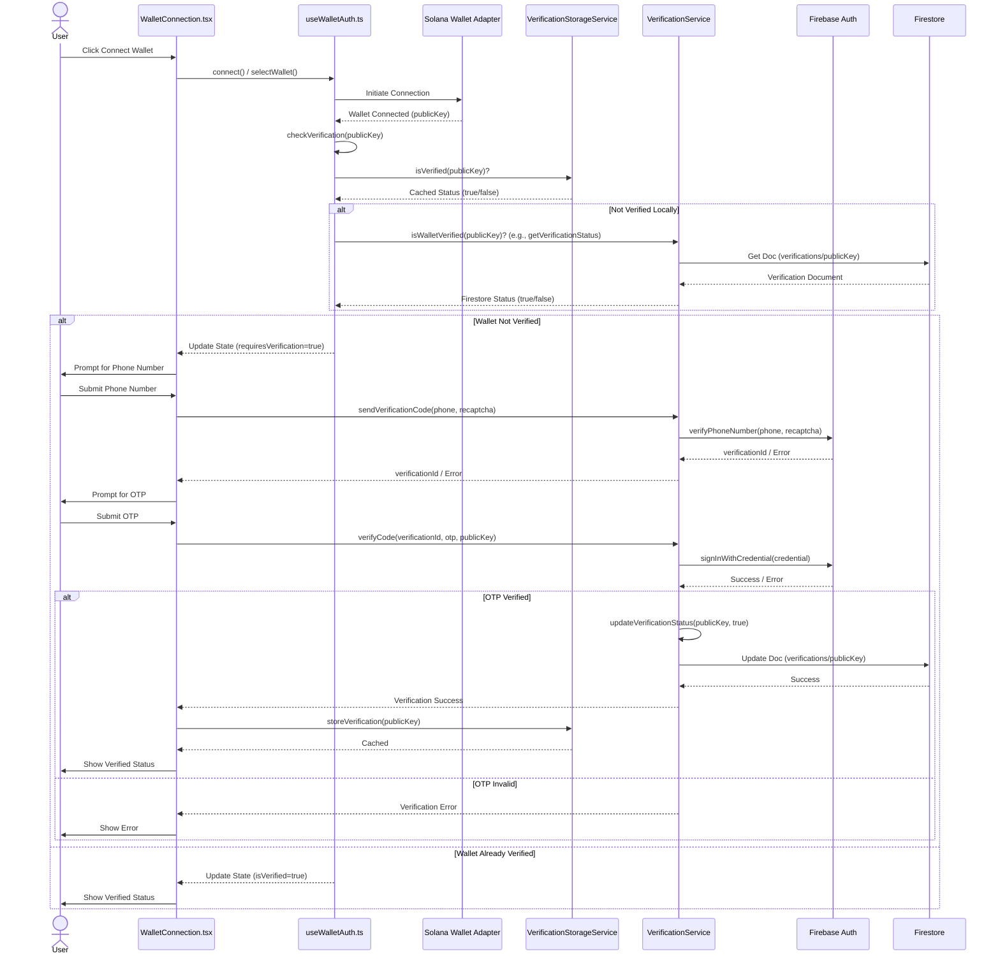

# Authentication and Verification Flow

This document outlines the user authentication and phone verification flow within the dApp. It describes how users connect their Solana wallets and, if required, verify their phone numbers using Firebase.

## Overview

The flow is designed to link a verified phone number to a user's Solana wallet address. This process involves several key components and services working together:

1.  **Wallet Connection:** User initiates connection to their Solana wallet.
2.  **Verification Check:** The system checks if the connected wallet requires phone verification.
3.  **Phone Verification Process:** If needed, the user undergoes OTP-based phone verification via Firebase.
4.  **Status Storage:** Verification status is stored in Firestore and cached locally.

## Key Components

*   **`WalletConnection.tsx` (Component):** Manages the UI for wallet connection and the overall verification steps.
*   **`useWalletAuth.ts` (Hook):** Encapsulates wallet state logic, connection/disconnection, and initiates verification checks.
*   **`@solana/wallet-adapter-react` (Library):** Provides the core functionality for connecting to various Solana wallets.
*   **[`VerificationService` (`src/system/services/auth/verification.ts`)](../services/auth/verification-service.md):** Handles the business logic for phone verification, including interaction with Firebase Auth and Firestore.
*   **[`VerificationStorageService` (`src/system/services/auth/storage.ts`)](../services/auth/storage-service.md):** Manages caching of verification status in the browser's localStorage.
*   **Firebase Auth:** Google's Firebase service used for sending OTPs to phone numbers and verifying them.
*   **[Firestore](../services/firestore.md):** Google's NoSQL database used to store persistent verification status (primarily in the `verifications` collection), attempts, and cooldowns.

## Detailed Flow

The sequence of operations is as follows:

1.  **User Initiates Wallet Connection:**
    *   The user clicks a "Connect Wallet" button (likely managed by `WalletConnection.tsx`).
    *   The `@solana/wallet-adapter-react` library handles the selection and connection to the user's chosen Solana wallet (e.g., Phantom, Solflare).
    *   `useWalletAuth.ts` hook manages the connection state.

2.  **Wallet Connected & Verification Check:**
    *   Once the wallet is connected, `useWalletAuth.ts` receives the user's `publicKey` (wallet address).
    *   It then calls `checkVerification(publicKey)` to determine the verification status.
    *   `checkVerification` first queries `VerificationStorageService.isVerified(walletAddress)` to check for a valid, non-expired local cache entry.
        *   If locally verified, the flow may end here, granting verified access.
    *   If not found in local storage or expired, `checkVerification` calls `verificationService.isWalletVerified(walletAddress)` (this method seems to be missing in the provided `verification.ts` but is called in `useWalletAuth.ts`, assuming it calls `getVerificationStatus` or similar in `VerificationService`). This service then queries the `verifications` collection in Firestore.

3.  **Phone Verification Process (if required):**
    *   If the wallet is not verified (neither locally nor in Firestore), `WalletConnection.tsx` (or a sub-component like `PhoneVerification.tsx`) prompts the user for phone verification.
    *   **User Submits Phone Number:** The user enters their phone number.
    *   **Send OTP:**
        *   The UI calls `verificationService.sendVerificationCode(phoneNumber, recaptchaVerifier)`. An `ApplicationVerifier` (reCAPTCHA) is required by Firebase.
        *   `VerificationService` interacts with Firebase Auth to send an OTP/verification code via SMS to the provided phone number.
        *   Firebase Auth returns a `verificationId`.
    *   **User Submits OTP:** The user receives the OTP on their phone and enters it into the dApp.
    *   **Verify OTP:**
        *   The UI calls `verificationService.verifyCode(verificationId, otpCode, walletAddress)`.
        *   `VerificationService` sends the `verificationId` and `otpCode` to Firebase Auth for validation.
        *   If successful, Firebase confirms the credential.

4.  **Update and Store Verification Status:**
    *   Upon successful OTP verification by Firebase, `verificationService.verifyCode` calls `verificationService.updateVerificationStatus(walletAddress, true)`.
    *   This updates the Firestore document in the `verifications` collection for the given `walletAddress`, setting `isVerified` to `true` and recording `lastVerified` and `updatedAt` timestamps.
    *   `WalletConnection.tsx` then calls `verificationStorageService.storeVerification(walletAddress)` to cache the successful verification status in `localStorage` for 90 days.

5.  **Access Granted:** The user is now considered verified, and the UI updates accordingly.

## Development Mode Considerations

*   **Test Phone Numbers:** `VerificationService` includes a set of predefined test phone numbers (`+16505550001`, etc.).
*   **Test Verification Code:** For these test numbers, a static verification code (`123456`) can be used.
*   **Simulated SMS:** In development, the actual SMS sending is simulated if a test number is used, and `sendVerificationCode` returns a test `verificationId`. `verifyCode` accepts the test code for this ID. This allows developers to test the verification flow without incurring SMS costs or requiring actual phones. Refer to the [VerificationService documentation](../services/auth/verification-service.md) for more details on its specific development mode behaviors.

## Sequence Diagram (Conceptual)

**Note on `isWalletVerified` in `VerificationService`:** The method `isWalletVerified` is called by `useWalletAuth.ts` but is not explicitly defined in the provided `src/system/services/auth/verification.ts`. It's assumed this maps to functionality within `getVerificationStatus` which returns the full status object. The hook then likely checks the `isVerified` property of this object.

This flow ensures that users can securely link their wallet to a verified phone number, with considerations for both production and development environments.
